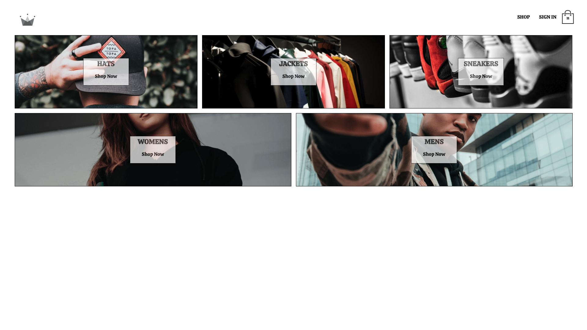
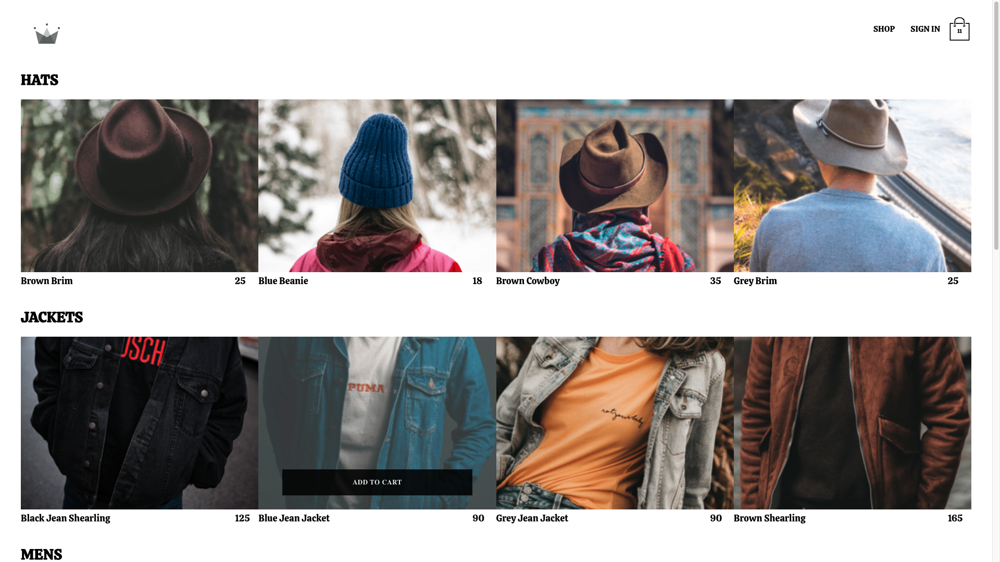
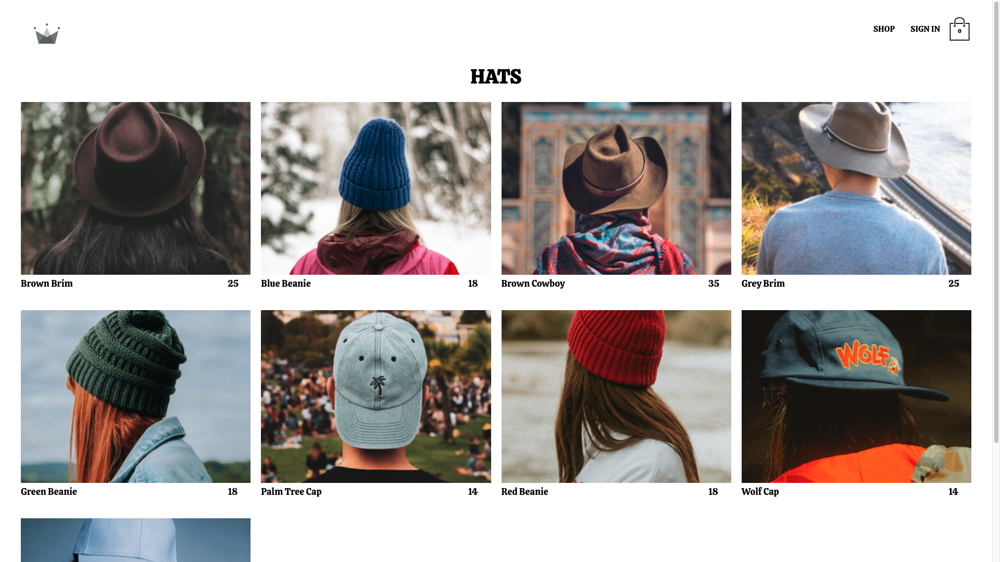
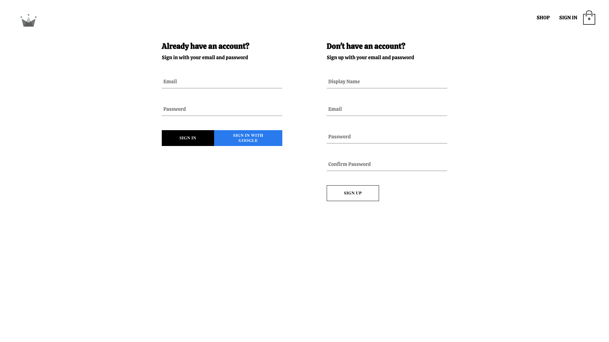
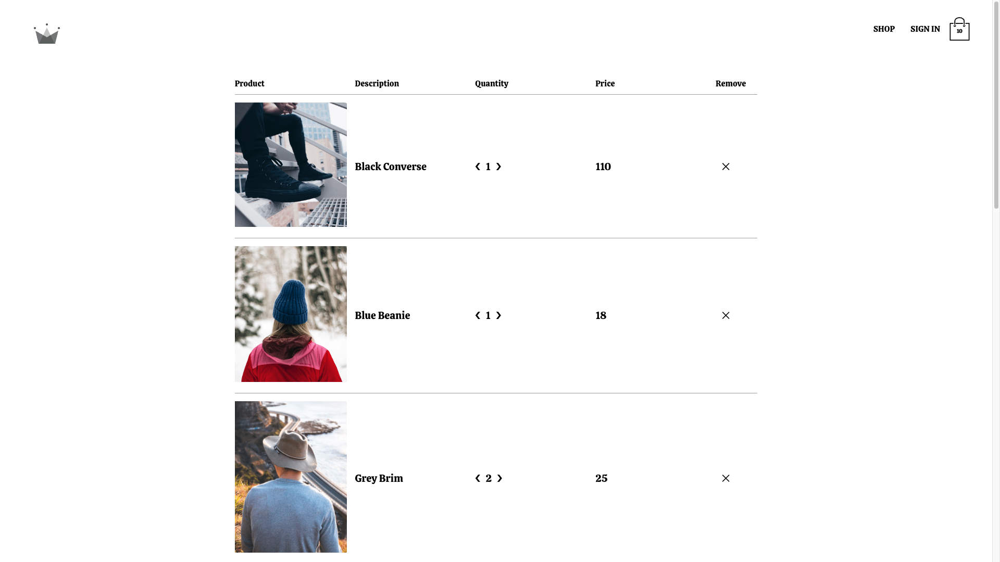
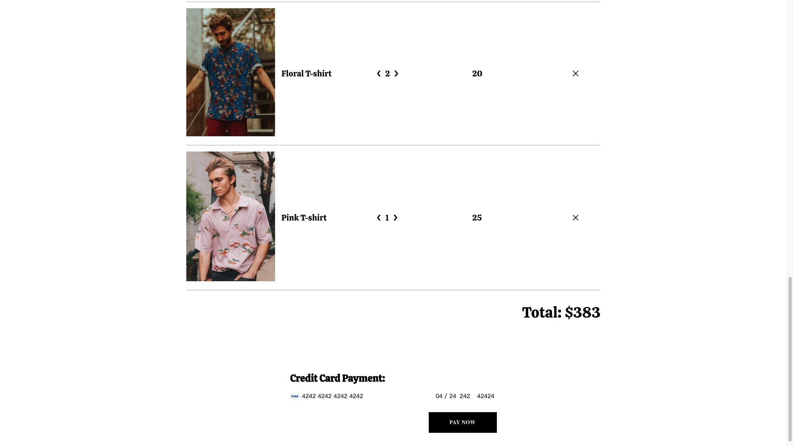

# Crown Clothing E-Commerce Website

## 📋 <a name="table">Table of Contents</a>

1. 🤖 [Introduction](#introduction)
2. 🔋 [Features](#features)
3. ⚙️ [Tech Stack](#tech-stack)
4. 🤸 [Quick Start](#quick-start)
5. 🕸️ [Snippets](#snippets)
6. 🔗 [Links](#links)
7. 📄 [License](#license)

## 🤖 Introduction

Crown Clothing is an advanced e-commerce platform designed to offer users an immersive shopping experience. This website enables users to sign up and log in using their email/password or Google accounts, explore a vast selection of products, manage their shopping cart, and securely process payments online.

## 🔋 Features

👉 **User Authentication**: Secure sign-up and login functionality with email/password and Google account integration.

👉 **Product Catalog**: A wide array of products displayed in an easily navigable catalog.

👉 **Shopping Cart Functionality**: Users can effortlessly add or remove items from their shopping cart.

👉 **Secure Online Payments**: Incorporates secure payment processing methods to ensure safe transactions.

👉 **Progressive Web App (PWA) Features**: Enhances user experience with offline access and faster load times, thanks to PWA capabilities.

👉  **Performance Optimizations**: Leverages React Suspense and Lazy for efficient code-splitting and lazy loading, significantly enhancing site performance.


## 🌐 Deployed Project

You can access the live demo of [Crown Clothing](https://gregarious-bublanina-5d6975.netlify.app/) deployed on Netlify, where you can explore the features and functionalities of the application.


## Website Walkthrough

### Step 1: Homepage
*Start your journey on the Crown Clothing homepage.*



### Step 2: Explore Products - Browse Categories
*Explore different categories of products available.*



### Step 3: Explore Products - Inside Category
*Browse products inside a specific category.*



### Step 4: User Authentication
*Secure sign-up and login functionality with email/password and Google account integration.*



### Step 5: Shopping Cart Interaction
*Add, increase/decrease quantity, and remove items from your shopping cart.*




### Step 6: Secure Checkout
*Proceed to a secure checkout for payment.*



## ⚙️ Tech Stack

- **Frontend**: React, TypeScript
- **Backend**: Node.js, Express.js, Firebase (Firestore for database), GraphQL with Apollo Client for efficient data fetching
- **Authentication**: Firebase Authentication, supporting email/password and Google Sign-In
- **Payment Processing**: Stripe API for secure payments, implemented with serverless functions
- **State Management**: Redux, Context API
- **Styling**: Styled-components for modular and scalable CSS
- **Testing**: Jest, Enzyme, and snapshot testing ensure the application's reliability and robustness.


## 🤸 Quick Start

Follow these steps to set up the project locally on your machine.

**Prerequisites**

Make sure you have the following installed on your machine:

- [Git](https://git-scm.com/)
- [Node.js](https://nodejs.org/en)
- [npm](https://www.npmjs.com/) (Node Package Manager)


**Cloning the Repository**

``` bash
git clone -b Redux https://github.com/TaiJoLo/crwn-clothing.git
cd crwn-clothing
```

**Installation**

Install the project dependencies using npm:
``` bash
npm install
```

**Running the Project**

```bash
npm run start
```
Open [http://localhost:3000](http://localhost:3000) in your browser to view the project.


## 🤝 Contributing

We welcome contributions to Crown Clothing! If you'd like to contribute, please fork the repository, create a feature branch, and submit your pull request for review.

## 📄 License

This project is licensed under the MIT License - see the [LICENSE](https://github.com/TaiJoLo/crwn-clothing/blob/Redux/LICENSE)https://github.com/TaiJoLo/crwn-clothing/blob/Redux/LICENSE) file for details.
